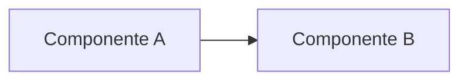

Introdução: por que este assunto importa / contexto em 2–3 frases.

## Seção

Conteúdo...

```java title="Exemplo.java" {2}
public class Exemplo {
  // linha destacada
}
```

## Diagrama (se fizer sentido)



## Conclusão

O que fica de aprendizado.
