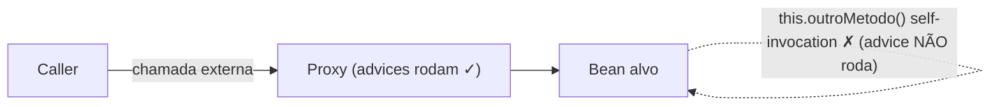

**AOP (Aspect-Oriented Programming)** é um paradigma que separa *cross-cutting concerns* (preocupações transversais como log, transação, cache, segurança, métricas) da lógica de negócio. Em vez de espalhar `try/finally`, checagem de permissão e código de instrumentação em todo método, você descreve **onde** aplicar (pointcut) e **o quê** aplicar (advice) em uma classe separada chamada **aspect**.

O Spring implementa AOP em runtime via **proxies**: o container substitui o bean original por um objeto envoltório que intercepta as chamadas. Dois tipos são usados — **JDK Dynamic Proxy** (proxy baseado em interface, embutido na JDK desde a 1.3) e **CGLIB** (proxy via subclasse gerada por bytecode, reempacotado dentro do `spring-core`). Um **aspect custom** é simplesmente uma classe sua marcada com `@Aspect` que define seus próprios pointcuts e advices, em vez de usar os prontos do Spring (`@Transactional`, `@Async`, `@Cacheable` etc.).

## 1. O problema que AOP resolve

Cross-cutting concerns são preocupações que se repetem em muitas classes sem pertencerem ao domínio delas: log, transação, cache, segurança, métricas, retry, auditoria. Sem AOP, esse código se mistura com a regra de negócio e vira ruído. A ideia central do AOP é *modularizar* essas preocupações em unidades separadas (aspects) e *aplicá-las declarativamente* em pontos específicos da execução, mantendo as classes de negócio limpas.

## 2. Vocabulário fundamental

Os termos vêm do AspectJ, e o Spring adota os mesmos:

- **Aspect** — módulo que encapsula uma cross-cutting concern. No Spring, uma classe com `@Aspect`. Ex.: `LoggingAspect`, `MetricsAspect`, `RetryAspect`.
- **Join point** — um ponto na execução onde o aspect pode atuar. **No Spring AOP, join point é sempre execução de método** (não cobre acesso a campo, construção de objeto etc., como o AspectJ puro).
- **Pointcut** — predicado que seleciona quais join points casam. É a *expressão* que descreve "onde" aplicar. Ex.: `execution(* com.exemplo.servico..*(..))`. O Spring usa a linguagem de pointcut do AspectJ.
- **Advice** — a ação que o aspect executa em um join point. É o "o quê" rodar (antes, depois, em volta).
- **Target (objeto alvo)** — o objeto sendo aconselhado. Como o Spring AOP é proxy-based, ele fica **sempre por trás de um proxy** em runtime.
- **Weaving** — o processo de "costurar" os aspects no código. Pode acontecer em compilação (AspectJ compile-time), no carregamento da classe (load-time) ou em runtime (Spring AOP).
- **Introduction** — declarar métodos ou campos adicionais em um tipo; permite um bean implementar uma interface nova em runtime.

## 3. Tipos de advice

Cada um corresponde a uma anotação dentro de uma classe `@Aspect`:

- **`@Before`** — roda **antes** do método alvo. Não pode evitar a execução (só lançando exceção).
- **`@AfterReturning`** — roda **depois**, se o método retornou normalmente. Tem acesso ao valor de retorno.
- **`@AfterThrowing`** — roda quando o método lança exceção. Tem acesso à exceção.
- **`@After`** — roda **sempre** depois (análogo ao `finally`).
- **`@Around`** — o mais poderoso: envolve toda a chamada. Recebe um `ProceedingJoinPoint` e decide se chama `proceed()` ou não. Permite modificar argumentos, transformar o retorno, suprimir a chamada. **Use o advice menos potente que resolve o caso** — a recomendação oficial é evitar `@Around` quando um `@AfterReturning` já dá conta, porque o `@Around` exige chamar `proceed()` manualmente (esquecer é bug).

## 4. Como o Spring implementa — proxy em runtime

Diferente do AspectJ puro, que faz **bytecode weaving**, o **Spring AOP é proxy-based em runtime**: quando um bean tem advices aplicáveis, o container devolve um *proxy* no lugar da instância original. O proxy implementa/estende o tipo do bean e intercepta cada chamada, executando o advice antes/depois de delegar para o alvo real.



Consequências do modelo:

- Só **execuções de método público** são interceptadas — campo, método privado e construtor não passam pelo proxy.
- **Self-invocation não funciona**: quando um método chama outro da própria classe via `this.outroMetodo()`, a chamada não passa pelo proxy e o advice não roda. É a pegadinha clássica do `@Transactional` que silenciosamente não abre transação.
- O Spring AOP é mais simples e mais limitado que o AspectJ puro; em troca, não exige compilador especial nem agente de bytecode.

## 5. JDK Dynamic Proxy — proxy baseado em interface

Disponível desde a JDK 1.3 (`java.lang.reflect.Proxy` + `InvocationHandler`). Gera, em runtime, uma classe que **implementa as interfaces** passadas. Todas as chamadas são redirecionadas para o método `invoke(Object proxy, Method method, Object[] args)` do handler.

Exemplo em Java puro (sem Spring) de um proxy que loga antes e depois:

```java title="ProxyPuro.java"
import java.lang.reflect.*;

interface Servico {
    void executar(String dado);
}

class ServicoImpl implements Servico {
    public void executar(String dado) {
        System.out.println("executando: " + dado);
    }
}

class LogHandler implements InvocationHandler {
    private final Object alvo;
    LogHandler(Object alvo) { this.alvo = alvo; }

    public Object invoke(Object proxy, Method m, Object[] args) throws Throwable {
        System.out.println("ANTES de " + m.getName());
        Object resultado = m.invoke(alvo, args);
        System.out.println("DEPOIS de " + m.getName());
        return resultado;
    }
}

Servico alvo = new ServicoImpl();
Servico proxy = (Servico) Proxy.newProxyInstance(
    alvo.getClass().getClassLoader(),
    new Class<?>[] { Servico.class },
    new LogHandler(alvo));

proxy.executar("x");
// ANTES de executar
// executando: x
// DEPOIS de executar
```

Características práticas:

- **Exige que o alvo implemente pelo menos uma interface** — o proxy só intercepta métodos declarados em interfaces.
- O cast é sempre para a **interface**, nunca para a classe concreta.
- Performance excelente, sem dependência externa, parte do JDK.
- Foi a estratégia **default do Spring Framework** por anos quando havia interface disponível.

## 6. CGLIB — proxy via subclasse

CGLIB (*Code Generation Library*) gera bytecode: cria em runtime uma **subclasse** da classe alvo, sobrescrevendo os métodos não-`final` para inserir o advice. O Spring usa CGLIB reempacotado dentro do `spring-core` (sem dependência separada).

- **Não precisa de interface** — funciona com qualquer classe concreta.
- **Não proxifica métodos `final`** (não dá para sobrescrever) nem **classes `final`** (não dá para estender).
- O construtor do alvo **não é chamado duas vezes** no Spring moderno: a instância CGLIB é criada via Objenesis, que ignora o construtor.
- Levemente mais pesado que o JDK Proxy (gera bytecode + carrega classe nova), mas na prática a diferença é desprezível.

**Default do Spring Boot:** a partir da versão **2.0**, o Spring Boot usa **CGLIB por padrão** (`spring.aop.proxy-target-class=true` implícito), independente de o bean implementar interface. O Spring Framework puro continua preferindo JDK quando há interface.

## 7. Comparativo rápido

| | JDK Dynamic Proxy | CGLIB |
| --- | --- | --- |
| **Como funciona** | Implementa interfaces em runtime | Subclasse via bytecode em runtime |
| **Exige interface?** | Sim | Não |
| **Funciona com `final`?** | Não se aplica | Não (métodos e classes `final` ficam de fora) |
| **Cast para** | Interface | Classe concreta (ou interface) |
| **Origem** | JDK (`java.lang.reflect.Proxy`) | Biblioteca, reempacotada no `spring-core` |
| **Default Spring Framework** | Sim, quando há interface | Sim, quando não há interface |
| **Default Spring Boot 2.0+** | Não (precisa forçar) | Sim, sempre |

## 8. O que é um "aspect custom"

Quando você usa `@Transactional`, `@Async`, `@Cacheable` ou `@Scheduled`, está consumindo aspects **prontos** do Spring. Um **aspect custom** é um aspect que você mesmo escreve para uma preocupação transversal do seu sistema.

Exemplo: medir o tempo de execução de qualquer método de serviço.

```java title="TimingAspect.java"
import org.aspectj.lang.ProceedingJoinPoint;
import org.aspectj.lang.annotation.Around;
import org.aspectj.lang.annotation.Aspect;
import org.aspectj.lang.annotation.Pointcut;
import org.springframework.stereotype.Component;

@Aspect
@Component
public class TimingAspect {

    // Pointcut: todos os métodos públicos de qualquer classe
    // anotada com @Service no pacote com.exemplo
    @Pointcut("execution(public * com.exemplo..*(..)) " +
              "&& within(@org.springframework.stereotype.Service *)")
    public void servicos() {}

    @Around("servicos()")
    public Object medir(ProceedingJoinPoint pjp) throws Throwable {
        long inicio = System.nanoTime();
        try {
            return pjp.proceed();  // chama o método real
        } finally {
            long ms = (System.nanoTime() - inicio) / 1_000_000;
            String nome = pjp.getSignature().toShortString();
            System.out.println(nome + " levou " + ms + "ms");
        }
    }
}
```

Com isso, qualquer `@Service` do pacote ganha medição de tempo automaticamente, sem alterar uma linha das classes de negócio. É esse o ganho concreto do AOP.

Dependência necessária no Spring Boot:

```xml title="pom.xml"
<dependency>
    <groupId>org.springframework.boot</groupId>
    <artifactId>spring-boot-starter-aop</artifactId>
</dependency>
```

O starter traz o `aspectjweaver` — mas apenas para parsear as expressões de pointcut; o weaving continua em runtime, via proxy.

## 9. Cuidados práticos

- **Self-invocation não passa pelo proxy.** Se `metodoA()` chama `this.metodoB()` na mesma classe, o advice de `metodoB` não roda. Soluções: separar em outro bean, ou injetar o próprio bean (`self`) e chamar por ele.
- **Apenas métodos `public`** são aconselhados por padrão no Spring AOP.
- **`bean.getClass()` retorna a classe do proxy**, não a real. Para ler anotações via reflection, use `AopUtils.getTargetClass(bean)`.
- **Forçar JDK Dynamic Proxy** no Spring Boot: `spring.aop.proxy-target-class=false` (em geral não vale a pena; CGLIB é mais robusto).
- **Performance:** o overhead do proxy é baixo, mas existe. Para hot paths críticos, meça antes de assumir impacto.

## Fontes

- Spring Framework Reference — [AOP Concepts](https://docs.spring.io/spring-framework/reference/core/aop/introduction-defn.html)
- Spring Framework Reference — [Proxying Mechanisms](https://docs.spring.io/spring-framework/reference/core/aop/proxying.html)
- Spring Framework Reference — [AOP Proxies](https://docs.spring.io/spring-framework/reference/core/aop/introduction-proxies.html)
- Oracle — [Dynamic Proxy Classes](https://docs.oracle.com/javase/8/docs/technotes/guides/reflection/proxy.html)
- Baeldung — [Dynamic Proxies in Java](https://www.baeldung.com/java-dynamic-proxies)
- Baeldung — [Pointcut Expressions in Spring](https://www.baeldung.com/spring-aop-pointcut-tutorial)
