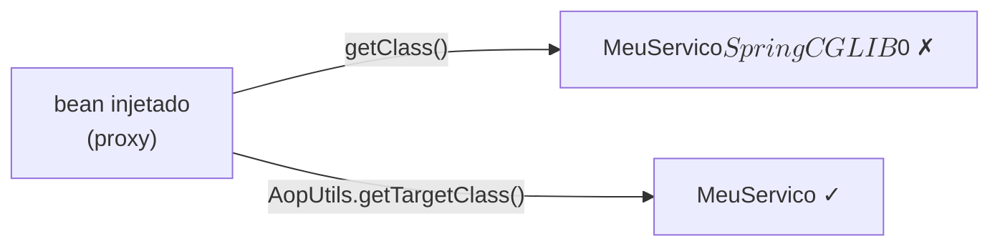

No Spring, anotações como `@Transactional`, `@Async`, `@Cacheable`, `@Scheduled` e `@PreAuthorize` só funcionam porque o container troca o bean original por um **proxy** que intercepta as chamadas (o modelo completo está no post [AOP no Spring — JDK Dynamic Proxy, CGLIB e aspects custom](/posts/aop-jdk-proxy-cglib/)). O efeito colateral: `bean.getClass()` deixa de retornar a classe real — retorna a do proxy gerado. **`AopUtils.getTargetClass(bean)`** é o utilitário oficial do Spring que **desembrulha o proxy** e devolve a classe original — essencial para reflection, leitura de anotações e logging.

## O que o AOP faz pelo seu código, na prática

Sem AOP, as preocupações transversais se espalham pelo método:

```java title="Sem AOP"
public Pedido criar(Pedido p) {
    long inicio = System.currentTimeMillis();
    tx.begin();
    try {
        if (!user.hasRole("ADMIN")) throw new AccessDenied();
        log.info("criando pedido {}", p);
        var salvo = repo.save(p);
        tx.commit();
        return salvo;
    } catch (Exception e) {
        tx.rollback();
        throw e;
    } finally {
        metrics.record("criar", System.currentTimeMillis() - inicio);
    }
}
```

Com AOP, o método volta a falar só de negócio:

```java title="Com AOP"
@Transactional
@PreAuthorize("hasRole('ADMIN')")
@Timed("criar")
public Pedido criar(Pedido p) {
    log.info("criando pedido {}", p);
    return repo.save(p);
}
```

Cada anotação corresponde a um *aspect* registrado no container. E é exatamente por isso que o bean que você recebe injetado **não é** a sua classe — é o proxy que executa esses aspects.

## O problema: `bean.getClass()` mente

Como o bean injetado é o proxy, `getClass()` devolve algo assim:

```txt
br.com.exemplo.MeuServico$$SpringCGLIB$$0           // CGLIB
com.sun.proxy.$Proxy42                              // JDK
```

Isso quebra qualquer código que dependa da identidade da classe real:

- **Leitura de anotações via reflection** — o proxy CGLIB herda algumas, mas não todas; o JDK proxy não tem nenhuma do alvo.
- **Logging** com `getClass().getSimpleName()` — vira lixo ilegível.
- **Mapas do tipo `Map<Class<?>, Handler>`** que usam a classe como chave.
- Descoberta de metadados, `BeanPostProcessor`s, listeners de evento.



## O utilitário: `AopUtils.getTargetClass(Object)`

Do pacote `org.springframework.aop.support`:

```java
public static Class<?> getTargetClass(Object candidate)
```

Comportamento, segundo o javadoc do Spring:

> Determine the target class of the given bean instance which might be an AOP proxy. Returns the target class for an AOP proxy or the plain class otherwise. Never null.

Na prática:

- Se o bean **não** é proxy → retorna `bean.getClass()` direto.
- Se é proxy **CGLIB** → retorna a superclasse (a classe original que foi estendida).
- Se é proxy **JDK** → desembrulha via `TargetSource` e devolve a classe concreta do alvo.
- Se for proxy aninhado (proxy de proxy), desce até chegar no fundo.
- **Nunca retorna `null`** — garantia da API.

## Exemplo prático

```java title="Inspetor.java"
import org.springframework.aop.support.AopUtils;
import org.springframework.transaction.annotation.Transactional;

@Service
public class MeuServico {
    @Transactional
    public void processar() { /* ... */ }
}

@Component
public class Inspetor {
    public void inspecionar(Object bean) {
        System.out.println(bean.getClass());
        // MeuServico$$SpringCGLIB$$0

        System.out.println(AopUtils.getTargetClass(bean));
        // MeuServico

        // Agora dá para ler anotações da classe real:
        boolean tx = AopUtils.getTargetClass(bean)
                             .isAnnotationPresent(Transactional.class);
    }
}
```

## Os métodos parentes no `AopUtils`

- `isAopProxy(Object)` — `true` se o bean é um proxy Spring AOP (de qualquer tipo).
- `isCglibProxy(Object)` — `true` se é CGLIB especificamente.
- `isJdkDynamicProxy(Object)` — `true` se é JDK Dynamic Proxy.
- `AopProxyUtils.ultimateTargetClass(Object)` — versão mais agressiva, que também desembrulha `TargetSource` dinâmico (lazy init, hot-swap). Em 99% dos casos `getTargetClass` resolve; para `TargetSource` dinâmico, `ultimateTargetClass` é mais confiável.

## Regra prática

Sempre que for inspecionar um bean Spring por reflection — ler anotações, comparar tipos, registrar em mapa por classe, logar nome legível — use `AopUtils.getTargetClass(bean)` em vez de `bean.getClass()`. Custa nada e evita bugs que só aparecem quando alguém adiciona um `@Transactional` no serviço meses depois e o proxy começa a interferir.

## Fontes

- Spring Framework Reference — [Proxying Mechanisms](https://docs.spring.io/spring-framework/reference/core/aop/proxying.html)
- Spring Framework Reference — [AOP Proxies](https://docs.spring.io/spring-framework/reference/core/aop/introduction-proxies.html)
- Javadoc — [AopUtils](https://docs.spring.io/spring-framework/docs/current/javadoc-api/org/springframework/aop/support/AopUtils.html)
- Javadoc — [TargetClassAware](https://docs.spring.io/spring-framework/docs/current/javadoc-api/org/springframework/aop/TargetClassAware.html)
- Javadoc — [AopProxyUtils](https://docs.spring.io/spring-framework/docs/current/javadoc-api/org/springframework/aop/framework/AopProxyUtils.html)
