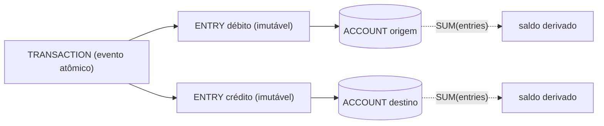
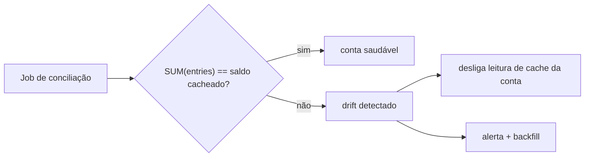
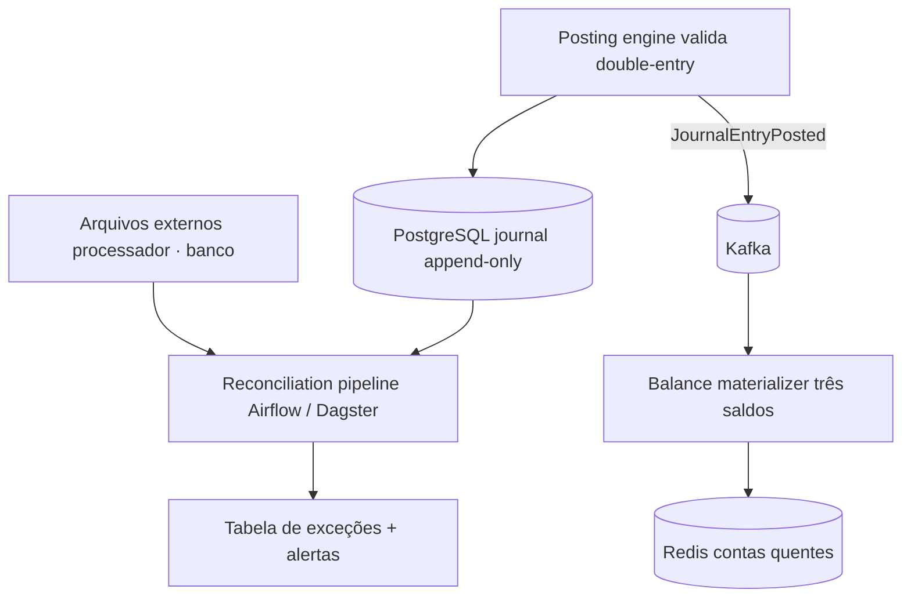

Todo sistema que movimenta valor — dinheiro, créditos, pontos — esbarra no mesmo conjunto de problemas: como garantir que nada é criado nem destruído por acidente, como responder "qual era o saldo naquela data" e como detectar quando o número exibido divergiu da verdade. A resposta madura da indústria é sempre a mesma: **ledger append-only + saldo materializado + conciliação**.

Este post resume 12 artigos sobre o assunto (a série *How to Scale a Ledger* e *Accounting for Developers*, da Modern Treasury, entre outros), com os exemplos de código convertidos para Java. O modelo central que todos compartilham:



## 1. Ledger confiável em sistema event-driven, sem transações gigantes

**Macro:** como construir um ledger de grau financeiro num sistema distribuído/event-driven **sem** envolver cada operação numa transação de banco gigante. A consistência vem de concorrência otimista, particionamento e unique constraints — não de locks globais.

**Pontos importantes:**

- **Event Sourcing:** cada mudança vira um evento imutável (depósito, saque, resgate). Você nunca guarda só o saldo final — guarda todos os eventos, e o saldo é reconstruível a partir deles. Isso dá trilha de auditoria completa e permite "replay" se a lógica mudar.
- **CQRS:** separa o lado de comando (recebe "Sacar \$30" e emite o evento `FundsWithdrawn`) do lado de query (assina os eventos e atualiza um read model rápido, ex.: tabela `account_balances`). A consulta de saldo lê o read model, não recalcula tudo.
- **O problema de concorrência:** dois eventos simultâneos na mesma conta (depósito de \$50 + saque de \$30) podem ler dados velhos e perder/duplicar dinheiro se não houver controle.
- **Três técnicas para resolver sem transação gigante:**
  1. **Optimistic Concurrency Control (OCC):** cada conta tem uma `version` inteira. Ao gravar um evento, você envia a versão esperada; se ela mudou (outro evento entrou antes), a gravação falha e você recarrega + tenta de novo (compare-and-swap).
  2. **Particionamento por conta:** sistemas tipo Kafka particionam por `account_id`; cada partição é processada por uma única thread → ordem serial garantida dentro da mesma conta, paralelismo entre contas diferentes.
  3. **Unique constraint** em `(aggregate_id, version)`: o próprio banco rejeita duas inserções com a mesma versão. Salvaguarda no nível do DB.
- **Idempotência:** ao reprocessar/replay, guarde a versão + aggregate_id aplicados; se o evento já foi aplicado, pule. Evita contar duas vezes.
- **Saldos "held" vs "available":** ledgers reais precisam de estados como fundos reservados (ex.: autorização de cartão). Modele eventos `FundsHeld`, `FundsReleased`, `FundsSettled` e mantenha uma projeção com `held_balance` e `available_balance`.

O schema do event store se resume a uma tabela `events` com `aggregate_id`, `version`, `event_type`, `payload` — e `UNIQUE (aggregate_id, version)`.

```java title="EventStore.java"
// Event store com checagem de versão esperada (compare-and-swap)
public class EventStore {

    private final DataSource dataSource;

    public EventStore(DataSource dataSource) {
        this.dataSource = dataSource;
    }

    // Versão atual (maior version) de uma conta
    public int getCurrentVersion(String accountId) throws SQLException {
        String sql = "SELECT COALESCE(MAX(version), 0) FROM events WHERE aggregate_id = ?";
        try (Connection conn = dataSource.getConnection();
             PreparedStatement stmt = conn.prepareStatement(sql)) {
            stmt.setString(1, accountId);
            try (ResultSet rs = stmt.executeQuery()) {
                return rs.next() ? rs.getInt(1) : 0;
            }
        }
    }

    // Append com verificação de versão esperada
    public void append(String accountId, int expectedVersion, List<DomainEvent> events)
            throws SQLException {
        try (Connection conn = dataSource.getConnection()) {
            // 1) Checa a versão mais recente
            int currentVersion = getCurrentVersion(accountId);

            // 2) Compara com a esperada
            if (currentVersion != expectedVersion) {
                throw new VersionConflictException(
                    "Version conflict! Expected " + expectedVersion + ", got " + currentVersion);
            }

            // 3) Insere cada evento com versão incrementada
            String insert = "INSERT INTO events " +
                "(aggregate_id, version, event_type, payload, created_at) " +
                "VALUES (?, ?, ?, ?, NOW())";
            try (PreparedStatement stmt = conn.prepareStatement(insert)) {
                for (DomainEvent event : events) {
                    int nextVersion = ++currentVersion;
                    stmt.setString(1, accountId);
                    stmt.setInt(2, nextVersion);
                    stmt.setString(3, event.getClass().getName());
                    stmt.setString(4, event.toPayloadJson());
                    stmt.executeUpdate();
                }
            }
        }
    }
}
```

```java title="WithdrawHandler.java"
// Tratamento do retry em caso de conflito de versão
public void handleWithdrawCommand(String accountId, BigDecimal withdrawAmount)
        throws SQLException {
    List<DomainEvent> events = eventStore.loadEvents(accountId);
    AccountAggregate aggregate = new AccountAggregate(accountId, events);

    List<DomainEvent> newEvents = aggregate.withdraw(withdrawAmount);
    int expectedVersion = aggregate.getVersion(); // ex: 5

    try {
        eventStore.append(accountId, expectedVersion, newEvents);
    } catch (VersionConflictException ex) {
        // Conflito de concorrência -> recarrega e tenta de novo
        List<DomainEvent> freshEvents = eventStore.loadEvents(accountId);
        AccountAggregate freshAggregate = new AccountAggregate(accountId, freshEvents);
        // ... revalida se o comando ainda é válido, então repete
    }
}
```

**Fonte:** [Building a Reliable Ledger in an Event-Sourced System Without Big DB Transactions](https://new2026.medium.com/building-a-reliable-ledger-in-an-event-sourced-system-without-big-db-transactions-879061a7ff87)

## 2. How to Scale a Ledger, Part I — por que usar um banco de ledger

**Macro:** toda empresa que move dinheiro em escala precisa de um ledger (banco de dados double-entry) como fonte única da verdade, em vez de embutir lógica financeira nos modelos de domínio (no objeto "pedido", "viagem" etc.).

**Pontos importantes:**

- **Por que os modelos tradicionais falham em escala:** necessidades de relatório crescem; dados ficam fragmentados entre múltiplos sistemas/SaaS; performance degrada (crons de payout perdem prazo, autorização de cartão atrasa); cenários de falha (cobrança dupla, saldo insuficiente, fraude) ficam frequentes e difíceis de reverter sem trilha de auditoria.
- **Modelo de dados central do ledger:** **Accounts** (pools discretos de valor) + **Transactions** (eventos monetários atômicos) + **Entries** (débitos e créditos individuais que compõem a transação).
- **As 4 garantias de um ledger escalável:**
  1. **Imutabilidade** — toda mudança é registrada; estados passados sempre recuperáveis.
  2. **Double-entry enforcement** — a API impede mover dinheiro sem especificar origem e destino.
  3. **Concurrency controls** — dinheiro não pode ser gasto duas vezes, mesmo com escritas paralelas/fora de ordem.
  4. **Agregações eficientes** — soma rápida de eventos num período.
- **O problema de "tradução fintech":** engenheiros falam a língua do domínio (pedidos), mas precisam traduzir para débitos/créditos. Eventos financeiros são fragmentados, vêm em formatos diferentes e de fontes mutáveis.
- **Consequência real de erros:** empresas relatam "alguns milhões sumindo" todo mês no ledger — não é o dinheiro que some, é a **atribuição** (o registro de quem é o dinheiro).
- **Por que adiar é arriscado:** construir um ledger double-entry performático leva anos e dezenas de engenheiros sênior; hoje dá para usar ledgers prontos.

**Fonte:** [How to Scale a Ledger, Part I](https://www.moderntreasury.com/journal/how-to-scale-a-ledger-part-i)

## 3. Part II — mapeando eventos financeiros

**Macro:** detalha os três objetos centrais (Account, Entry, Transaction) e como mapear eventos financeiros reais neles, incluindo o cálculo dos diferentes tipos de saldo.

**Pontos importantes:**

- **Dois princípios básicos:** todo evento monetário é logado num modelo double-entry consistente; **todos os saldos** mostrados a usuários são **lidos desse modelo** (nunca de um campo mutável solto).
- **Account = pool discreto de valor.** Deve reportar três saldos:
  - **Posted balance:** fundos totalmente liquidados.
  - **Pending balance:** liquidados + os que devem liquidar.
  - **Available balance:** disponível para gastar (exclui saídas esperadas e entradas não liquidadas).
- **O ciclo de vida de uma compra no cartão** ilustra como cada ação (compra, liquidação, pagamento, hold de hotel) afeta esses saldos.
- **Entry = registro imutável de movimento.** Saldos nunca são modificados direto; mudanças entram como entries. Campos imutáveis (`amount`, `direction`) + um campo mutável `discarded_at` (só para reversões de pending).
- **Discarding (descartar) vs. reversão:** só entries `pending` podem ser substituídas; posted e archived são permanentes. Descartar dá histórico limpo, sem misturar débitos do cliente com débitos gerados como reversão.
- **Normalidade da conta (chave!):** cada conta é **debit normal** (usos de fundos: ativos, despesas — aumentam com débito) ou **credit normal** (fontes de fundos: passivos, equity, receita — aumentam com crédito). Isso evita o problema de usar números positivos/negativos, onde duas contas não podem aumentar ao mesmo tempo.
- **5 campos para calcular qualquer saldo:** `posted_debits`, `posted_credits`, `pending_debits`, `pending_credits`, `normal_balance`. O ledger é otimizado para buscar esses 5 rápido e só computa os saldos sob demanda.

```java title="BalanceCalculator.java"
public enum NormalBalance { CREDIT, DEBIT }

public class BalanceCalculator {

    // Posted Balance
    public BigDecimal postedBalance(NormalBalance normal,
                                    BigDecimal postedCredits,
                                    BigDecimal postedDebits) {
        return switch (normal) {
            case CREDIT -> postedCredits.subtract(postedDebits);
            case DEBIT  -> postedDebits.subtract(postedCredits);
        };
    }

    // Pending Balance
    public BigDecimal pendingBalance(NormalBalance normal,
                                     BigDecimal pendingCredits,
                                     BigDecimal pendingDebits) {
        return switch (normal) {
            case CREDIT -> pendingCredits.subtract(pendingDebits);
            case DEBIT  -> pendingDebits.subtract(pendingCredits);
        };
    }

    // Available Balance
    public BigDecimal availableBalance(NormalBalance normal,
                                       BigDecimal postedCredits,
                                       BigDecimal postedDebits,
                                       BigDecimal pendingCredits,
                                       BigDecimal pendingDebits) {
        return switch (normal) {
            case CREDIT -> postedCredits.subtract(pendingDebits);
            case DEBIT  -> postedDebits.subtract(pendingCredits);
        };
    }
}
```

**Fonte:** [How to Scale a Ledger, Part II](https://www.moderntreasury.com/journal/how-to-scale-a-ledger-part-ii)

## 4. Part III — o modelo de Transaction

**Macro:** a **Transaction** (que agrupa as entries) é o que garante movimento de dinheiro atômico e força o double-entry. Sem ela, dá para deixar o ledger num estado inconsistente registrando só parte de um movimento.

**Pontos importantes:**

- **Uma Transaction garante:** **atomicidade** (todas as entries têm sucesso ou falham juntas), **consistência** (sem mudanças parciais) e **enforcement de double-entry** (entries balanceadas).
- **O risco sem Transaction:** se a entry de débito grava mas a de crédito falha (rede caiu), um lado foi debitado e o outro não recebeu → dinheiro perdido.
- **A API só deve permitir criar Transactions, nunca Entries diretas** — assim o cliente não causa inconsistência. A API gerencia as entries internamente.
- **Três estados / operações da Transaction:**
  1. **Pending** (estado inicial): persiste débito e crédito como `pending`, ainda não finalizado.
  2. **Posted** (finalizado): como entries são imutáveis, descarta as pending e cria novas entries posted. Preserva imutabilidade.
  3. **Archived** (cancelado antes de postar): só transações pending podem ser arquivadas; descarta as pending e cria novas com status `archived`, mantendo o histórico do cancelamento.
- Para garantir atomicidade, todas as entries não-descartadas de uma Transaction compartilham o status da Transaction — progridem juntas, tudo-ou-nada.

**Fonte:** [How to Scale a Ledger, Part III](https://www.moderntreasury.com/journal/how-to-scale-a-ledger-part-iii)

## 5. Part IV — recording vs authorizing

**Macro:** os dois modos em que um ledger opera: **Recording** (só registra o que já aconteceu em outros sistemas) e **Authorizing** (aprova/nega transações ativamente). A maioria dos ledgers só faz bem um dos dois; o ideal é decidir o modo no nível da Entry.

**Pontos importantes:**

- **Recording:** alto throughput de escrita (milhares/s), processamento assíncrono (leituras podem ficar stale por segundos, consistência eventual), suporte a queries complexas. O ledger **não é** a fonte da verdade — reflete o que já ocorreu (banco, processador de cartão).
  - **`effective_at`:** timestamp fornecido pelo cliente para "backdatar" a transação para quando o dinheiro realmente se moveu. Todas as entries herdam o `effective_at` da Transaction.
  - **Account Balance Versions:** como saldos passados podem mudar, cada conta tem uma `version` incrementada a cada entry criada/modificada. As entries guardam o `account_version`, permitindo saber exatamente quais entries correspondem a um saldo.
  - **Casos de uso:** exibir detalhes de conta, payouts de marketplace, servicing de empréstimo, cripto.
- **Authorizing:** consistência read-after-write (atualizações aplicadas instantaneamente), throughput menor (degrada perto de 100 entries/s por conta), asserções de saldo, controle de concorrência. Usado para mover dinheiro em tempo real (validar fundos suficientes).
  - **Version Locking:** o cliente envia a versão da conta junto com o request; o ledger rejeita se a versão no banco for diferente (lock otimista). Algoritmo: inicia transação DB → grava entry → atualiza versão com condição na versão atual → commita se atualizou, senão rollback.
  - **Balance Locking:** version locking sofre com "hot accounts" (contas com muita escrita, onde a versão muda rápido demais). A solução é travar pela condição de **saldo** (ex.: `gte: 0` — só commita se o saldo pendente não ficar negativo). Mais eficiente (2 chamadas em vez de 6) e expressa melhor a intenção.
- **Mixed-mode (o ideal):** decidir recording vs authorizing **por Entry**, não por conta. Ex.: numa autorização de cartão, a entry do cartão precisa de balance lock + consistência forte, mas a entry do processador (settlement diário) pode ser eventual + alto throughput. Ambas atômicas na mesma Transaction.

**Fonte:** [How to Scale a Ledger, Part IV](https://www.moderntreasury.com/journal/how-to-scale-a-ledger-part-iv)

## 6. Part V — imutabilidade e double-entry a fundo

**Macro:** aprofunda duas das quatro garantias: imutabilidade (qualquer estado passado do ledger pode ser reconstruído) e double-entry (dinheiro não pode ser criado nem destruído).

**Pontos importantes:**

- **Imutabilidade apesar de campos mutáveis:** Accounts mudam saldo, Transactions mudam de pending → posted/archived, Entries podem ser descartadas — mas tudo é construído sobre um **log append-only imutável** por baixo. Nada é deletado de fato.
- **Como consultar estados passados:** filtrando por `effective_at`, `account_version` e versão da transação. As entries presentes numa conta num dado momento são as que têm `effective_at <= timestamp` e não foram descartadas até lá.
- **Versões para precisão:** timestamps sozinhos não bastam (entries podem compartilhar o mesmo timestamp); versões em Accounts e Transactions permitem saber exatamente quais entries correspondem a um saldo.
- **Audit logs:** além do estado, registre **quem** mudou o quê e quando (várias API keys, usuários internos via admin UI). Recomenda-se um audit log ao lado do ledger.
- **Double-entry — validação:** toda Transaction precisa de pelo menos uma entry débito e uma crédito, e **débitos = créditos por moeda**.
- **Por que balancear por moeda importa:** num câmbio (ex.: comprar 1 ETH com USD), validar só o total quebra — você poderia criar ETH do nada e sumir com USD. O correto é **agrupar entries por moeda** e validar que débitos = créditos em cada moeda. Conversão de moeda sempre envolve ≥ 4 contas (não dá para usar só 2 com taxa de câmbio, porque a taxa flutua e não há taxa universal).

```java title="EntryRepository.java"
// Busca as entries presentes numa conta num determinado effective time
public List<Entry> findEntriesAt(String accountId, Instant timestamp) throws SQLException {
    String sql =
        "SELECT * FROM entries " +
        "WHERE account_id = ? " +
        "  AND effective_at <= ? " +
        "  AND (discarded_at IS NULL OR discarded_at >= ?)";
    try (Connection conn = dataSource.getConnection();
         PreparedStatement stmt = conn.prepareStatement(sql)) {
        stmt.setString(1, accountId);
        stmt.setTimestamp(2, Timestamp.from(timestamp));
        stmt.setTimestamp(3, Timestamp.from(timestamp));
        try (ResultSet rs = stmt.executeQuery()) {
            List<Entry> entries = new ArrayList<>();
            while (rs.next()) {
                entries.add(Entry.fromResultSet(rs));
            }
            return entries;
        }
    }
}
```

**Fonte:** [How to Scale a Ledger, Part V](https://www.moderntreasury.com/journal/how-to-scale-a-ledger-part-v)

## 7. Part VI — concorrência, performance e o job de conciliação

**Macro:** as duas últimas garantias — controle de concorrência (prevenir double-spend) e performance (leituras de saldo rápidas) — mais o **job de conciliação de drift de cache**, que fecha o padrão "registro + saldo + conciliação". É o artigo que melhor detalha a conciliação na prática.

**Pontos importantes:**

- **Idempotency keys (anti double-spend):** cenário clássico — o cliente faz o request, o ledger demora, o cliente dá timeout e re-tenta; o ledger acaba criando a transação duas vezes. A solução é deduplicar com uma chave de idempotência (string enviada pelo cliente, **gerada fora do loop de retry**). Se o ledger vê uma chave já armazenada, retorna a resposta anterior. Chaves guardadas por 24h.
- **Performance — cache de saldo:** somar todas as entries é O(n), lento com centenas de milhares de entries. Solução: **cachear** `pending_debits`, `pending_credits`, `posted_debits`, `posted_credits` para leitura em tempo constante.
  - **Current balance cache:** reflete todas as entries; atualizado **sincronamente** quando entries de autorização são gravadas (necessário para balance locks). O banco faz a matemática atomicamente.
  - **Effective time balance cache:** mais complexo — duas abordagens: *anchoring* (cacheia o saldo no fim de cada dia e soma as entries intra-dia) e *resulting balances* (guarda o saldo resultante após cada entry). Atualizado assincronamente via fila.
- **Monitorando o drift do cache (o job de conciliação):** ler saldo do cache melhora performance, mas o cache pode divergir das entries (a fonte da verdade). Tratamento em 3 passos:
  1. **Verificar regularmente** que o saldo cacheado de cada conta bate com a **soma das entries**.
  2. **Desligar automaticamente** as leituras de cache para contas que sofreram drift.
  3. Prover **ferramentas de backfill** e um runbook para o plantão triar e corrigir drift.



- **Tópicos avançados de escala:** account categories (agregação em grafo) para relatórios; busca flexível de transações (paginação por cursor, não offset); **write-ahead queues** para alto throughput (> 5.000 QPS); sharding de contas entre bancos (Spanner/CockroachDB) — com o desafio de manter a atomicidade double-entry entre shards.

```java title="RetryComIdempotencia.java"
// Idempotency key gerada FORA do loop de retry (mesma string em todas as tentativas)
String idempotencyKey = UUID.randomUUID().toString();
TransactionResponse response = null;

while (response == null || !response.isSuccessful()) {
    response = createTransaction(idempotencyKey);
}
```

```java title="ReconciliationJob.java"
// Conceito do job de conciliação: comparar saldo cacheado vs soma das entries
public void reconcileAccount(String accountId) throws SQLException {
    BigDecimal cachedBalance = balanceCache.getBalance(accountId);
    BigDecimal computedBalance = sumAllEntries(accountId); // SUM() sobre as entries

    if (cachedBalance.compareTo(computedBalance) != 0) {
        // Drift detectado: desliga leitura de cache e dispara alerta/backfill
        balanceCache.disableReads(accountId);
        alerting.raiseDrift(accountId, cachedBalance, computedBalance);
    }
}
```

**Fonte:** [How to Scale a Ledger, Part VI](https://www.moderntreasury.com/journal/how-to-scale-a-ledger-part-vi)

## 8. Accounting for Developers, Part I — os fundamentos

**Macro:** primer de contabilidade para desenvolvedores: os conceitos de double-entry traduzidos para termos técnicos, para quem constrói sistemas que movem dinheiro.

**Pontos importantes:**

- **Princípio central:** toda transação registra **de onde o dinheiro veio** e **para que foi usado**. Com isso você reconstrói saldos em qualquer data, rastreia movimento com auditabilidade total e alinha a lógica do sistema com finanças reais.
- **Falha mais comum:** software criando/destruindo registros de fundos acidentalmente (registros internos divergindo do banco, engines de conciliação dando mismatch, saldos que não fazem sentido). Uber, Square e Airbnb adotam double-entry justamente por isso.
- **Conceitos:** **Account** (pool segregado de valor), **Transaction** (evento atômico que afeta saldos; tem pelo menos duas entries e mantém o ledger balanceado), **Ledger** (log de eventos com impacto monetário).
- **Não mute saldos direto** — guarde transações imutáveis e **sempre compute o saldo a partir delas**. Mutar direto é mais simples/eficiente, mas vira fonte de erros difícil de detectar e conciliar.
- **Debit normal vs credit normal:** debit normal = usos de fundos (ativos, despesas) → aumentam com débito; credit normal = fontes de fundos (passivos, equity, receita) → aumentam com crédito.

| Tipo de conta | Débito | Crédito |
| --- | --- | --- |
| Ativo (Asset) | + | − |
| Passivo (Liability) | − | + |
| Equity | − | + |
| Receita (Revenue) | − | + |
| Despesa (Expense) | + | − |

- **Ledger balanceado:** soma dos saldos credit normal = soma dos saldos debit normal. Se não bate, o sistema criou ou perdeu dinheiro do nada.
- **Detalhe contra-intuitivo:** duas contas podem aumentar **ao mesmo tempo** (ex.: cliente deposita → o caixa da empresa aumenta E o saldo do usuário aumenta), porque uma é debit normal e a outra credit normal.

**Fonte:** [Accounting for Developers, Part I](https://www.moderntreasury.com/journal/accounting-for-developers-part-i)

## 9. Part II — o ledger de uma carteira digital

**Macro:** aplica os fundamentos construindo o ledger de uma carteira estilo Venmo, passo a passo: requisitos → chart of accounts → modelagem de transações → modelagem do banco.

**Pontos importantes:**

- **Chart of Accounts (COA) do app:** **Cash** (caixa real no banco) → ativo/debit normal; **Wallet Balance do usuário** (uma conta por usuário) → passivo/credit normal (você "deve" ao usuário); **Card Processing Fees** → despesa/debit normal; **Revenue** → credit normal.
- **Três transações modeladas:**
  1. **Transfer (A→B):** debita a carteira de quem envia, credita a de quem recebe.
  2. **Deposit:** crédito de \$300 na carteira; contrabalançado por dois débitos — taxa de cartão (\$6) + caixa (\$294). Tudo num único evento com múltiplas entries.
  3. **Withdrawal:** saque de \$500 + taxa de \$2,50 → debita \$502,50 da carteira, credita o caixa, reconhece \$2,50 de receita.
- **Modelagem do banco:** `accounts` (`id`, `user_id`, `account_type`, `normality`), `transactions` (`id`, `timestamp`, `description`), `entries` (`id`, `transaction_id`, `account_id`, `amount`, `direction`). **Invariante a impor:** soma dos débitos = soma dos créditos **por transação**.

```java title="ModeloLedger.java"
public enum Normality { DEBIT, CREDIT }
public enum Direction { DEBIT, CREDIT }

public class Account {
    private long id;
    private Long userId;          // pode ser nulo para contas internas (Cash, Revenue)
    private String accountType;   // "USER_WALLET", "CASH", "REVENUE", "CARD_FEES"
    private Normality normality;
    // getters/setters
}

public class LedgerTransaction {
    private long id;
    private Instant timestamp;
    private String description;
    private List<Entry> entries = new ArrayList<>();

    // Invariante: soma dos débitos == soma dos créditos
    public boolean isBalanced() {
        BigDecimal debits = entries.stream()
            .filter(e -> e.getDirection() == Direction.DEBIT)
            .map(Entry::getAmount)
            .reduce(BigDecimal.ZERO, BigDecimal::add);
        BigDecimal credits = entries.stream()
            .filter(e -> e.getDirection() == Direction.CREDIT)
            .map(Entry::getAmount)
            .reduce(BigDecimal.ZERO, BigDecimal::add);
        return debits.compareTo(credits) == 0;
    }
}

public class Entry {
    private long id;
    private long transactionId;
    private long accountId;
    private BigDecimal amount;
    private Direction direction;
    // getters/setters
}
```

**Fonte:** [Accounting for Developers, Part II](https://www.moderntreasury.com/journal/accounting-for-developers-part-ii)

## 10. Part III — um marketplace de empréstimos

**Macro:** aplica os princípios num marketplace de empréstimo P2P — o caso mais complexo da série, com juros, amortização, investidores e tomadores.

**Pontos importantes:**

- **Dois tipos de dado:** **histórico** (estado financeiro atual, baseado em transações postadas — fica no ledger) e **prospectivo** (taxas de juros, prazos, breakdown de juros vs principal — fica **fora** do ledger, numa **tabela de amortização**). Manter um separado do outro mantém o data store limpo.
- **Chart of Accounts:** Cash (debit normal) + Revenue de juros (credit normal) + **dois conjuntos de contas por usuário** (principal e juros). Conta de principal/juros do investidor = credit normal (você deve a ele); do tomador = debit normal (ele deve a você).
- **5 transações modeladas:** depósito do investidor; desembolso ao tomador; **acúmulo mensal de juros** (credita juros do investidor +\$40, debita juros do tomador +\$50, e a diferença de \$10 vira **revenue** — o spread); pagamento mensal do tomador; payout do investidor no vencimento.
- **Arquitetura final:** um **ledger central** com constraints double-entry + um **Transaction Logic Service** (converte eventos/webhooks em entries válidas) + uma **Amortization Schedule** (calcula parcelas) + um **Chart of Accounts** com ≥ 6 tipos de conta.

**Fonte:** [Accounting for Developers, Part III](https://www.moderntreasury.com/journal/accounting-for-developers-part-iii)

## 11. Arquitetura de plataformas de fidelidade (Open Loyalty)

**Macro:** visão de arquitetura de plataformas de pontos/fidelidade — um domínio onde o mesmo padrão de ledger aparece fora do dinheiro. Defende plataformas modulares e API-first, com o **points ledger** como um dos componentes centrais.

**Pontos importantes:**

- **Componentes centrais:** rules engine (avalia ações e decide o que disparar), **points ledger** (registro financeiro do programa — cada ponto ganho, resgatado, transferido ou expirado, com auditoria completa), fulfillment service, API layer, event & messaging layer, customer data layer.
- **O points ledger é o componente mais exigente tecnicamente:** quando o cliente faz uma compra, **os pontos devem ser adicionados exatamente uma vez**, mesmo se o request for repetido. Um ledger que erra isso produz erros de saldo difíceis de detectar e caros de corrigir. Em alto volume, é tratado como **serviço independente**, não um campo num cadastro de cliente.
- **Idempotência na API é crítica** — concessão dupla de pontos ou resgate duplo é risco operacional real.
- **Fluxo ponta a ponta:** compra → evento via API → messaging roteia para a rules engine → engine avalia campanhas/tier → dispara fulfillment → **ledger atualizado com registro de auditoria** → evento "reward issued" emitido. Cada passo é um serviço independente: se o fulfillment atrasa, o update do ledger ainda completa (falhas contidas).
- **Quando NÃO precisa dessa complexidade:** programa simples/single-channel → uma plataforma all-in-one é mais pragmática. A arquitetura deve seguir as necessidades reais.

**Fonte:** [Loyalty System Architecture](https://www.openloyalty.io/insider/loyalty-system-architecture-how-modern-platforms-are-built)

## 12. Payment Ledger Architecture (Trio) — os 6 fatores

**Macro:** define um ledger de pagamentos por 6 fatores e dá a stack arquitetural concreta em que a maioria dos sistemas em produção converge. O resumo mais direto e prático de tudo.

**Os 6 fatores:**

1. **Double-entry como invariante de banco (não lógica de aplicação):** débito + crédito da mesma transação gravados numa **única transação atômica de banco**. Use CHECK constraint ou validação pré-commit que confirma que a entry soma zero. Errar isso = drift silencioso de saldo.
2. **Derivar saldos das entries (nunca guardar saldo corrente):** uma coluna `balance` mutável **dá drift** com qualquer escrita concorrente, falha parcial, correção manual ou migração. Em escala, o `SUM()` fica caro → crie um **saldo materializado** (view cacheada, otimizada para leitura, que recalcula quando novas entries entram — mas **sempre verificada contra as entries na conciliação**).
3. **Journals imutáveis com reversões explícitas (sem UPDATE/DELETE):** registros inalteráveis para auditorias (SOC 2, PCI DSS, AML/KYC). Reversão = uma **nova** entry compensatória. O papel de banco usado pelo posting engine **não deve ter permissão** de UPDATE/DELETE nas tabelas de journal.
4. **Modelo de três saldos:** **ledger balance** (liquidado), **pending** (em trânsito) e **available** (o que pode ser gasto agora). Colapsar os três num só aumenta risco de overdraft/double-spend.
5. **CQRS — separar escrita de leitura:** escrita fortemente consistente, atômica, durável; leitura rápida via saldo materializado. Quando o saldo alimenta uma **decisão financeira**, valida-se contra o journal canônico, não contra a view possivelmente stale.
6. **Conciliação como entregável de engenharia (não planilha de finanças):** correção **interna** (entries balanceiam, saldos derivados batem com o journal) e **externa** (o ledger bate com processador/banco/câmara). Um **pipeline automatizado** que roda diariamente ou após cada janela de settlement, casa cada linha e expõe discrepâncias com classificação de severidade, alertas e tracking de exceções. (O colapso da Synapse em 2024 foi, em grande parte, uma falha de conciliação de ledger.)

**A stack de referência:**



**Build vs buy:** construa se o ledger é diferencial competitivo ou se os requisitos excedem um Ledger-as-a-Service; use LaaS ou open-source (Formance Ledger, Blnk) se o ledger é infraestrutura e time-to-market importa mais. A maioria começa melhor com LaaS/open-source e migra para custom quando a plataforma não atende um requisito.

**Fonte:** [Payment Ledger Architecture: How Modern Fintechs Design Ledgers](https://trio.dev/payment-ledger-architecture-fintech/)

## Síntese — o padrão em que os 12 artigos convergem

Independente do domínio — banco digital, carteira, marketplace, programa de pontos — o desenho final é o mesmo:

- **Cada movimento** é uma entry imutável num ledger append-only, com **idempotency key** (para nunca creditar duas vezes).
- **O saldo** é um **saldo materializado**: cache de leitura rápida, atualizado na mesma transação atômica do insert — mas **derivado e reconstruível** a partir das entries, nunca a fonte da verdade.
- **A conciliação** é um job/pipeline que soma as entries por conta, compara com o saldo materializado, detecta drift, desliga a leitura de cache da conta afetada e alerta — e, havendo sistema externo, casa também contra ele.
- **Double-entry vale além do dinheiro:** num sistema de pontos, por exemplo, credita-se a conta do cliente e debita-se uma conta de "passivo de pontos emitidos" — assim a soma sempre fecha e qualquer drift fica detectável.
