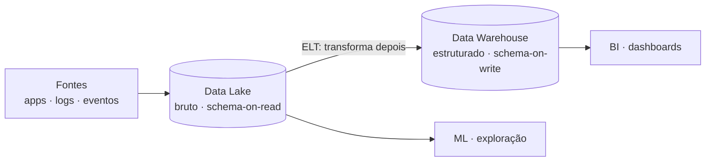

**Data Warehouse (DW)** armazena dados **estruturados**, já transformados e organizados para análise. Segue o esquema *schema-on-write* — a estrutura é definida **antes** de gravar os dados. Ideal para relatórios e dashboards de negócio (BI).

**Data Lake** armazena dados **brutos** em qualquer formato (estruturado, semi-estruturado, não-estruturado). Segue o esquema *schema-on-read* — a estrutura é definida apenas **na hora da leitura**. Ideal para exploração, machine learning e big data.

## O comparativo

| | Data Warehouse | Data Lake |
| --- | --- | --- |
| **Dados** | Estruturados | Qualquer formato |
| **Schema** | On-write | On-read |
| **Transformação** | Antes de gravar (ETL) | Depois de gravar (ELT) |
| **Usuários** | Analistas de negócio | Engenheiros, cientistas de dados |
| **Custo** | Mais caro por GB | Mais barato por GB |
| **Velocidade de query** | Alta (dados otimizados) | Mais lenta (dados brutos) |
| **Exemplos** | Redshift, BigQuery, Snowflake | S3 + Glue, Azure Data Lake, GCS |

## Resumo prático

O DW é o dado *pronto para consumo*; o Data Lake é o *repositório bruto* de tudo. Muitas arquiteturas modernas usam **os dois juntos** — o Lake como camada de ingestão e histórico completo, e o DW como camada analítica de consumo.

E existe o terceiro elemento: o **Data Lakehouse** (Delta Lake, Apache Iceberg), que une o melhor dos dois mundos — o armazenamento barato e flexível do Lake com a performance, as transações e a governança do DW, aplicadas diretamente sobre os arquivos do lake.

## Fontes

- AWS — [What is a Data Lake?](https://aws.amazon.com/what-is/data-lake/)
- Databricks — [What is a Data Lakehouse?](https://www.databricks.com/glossary/data-lakehouse)
