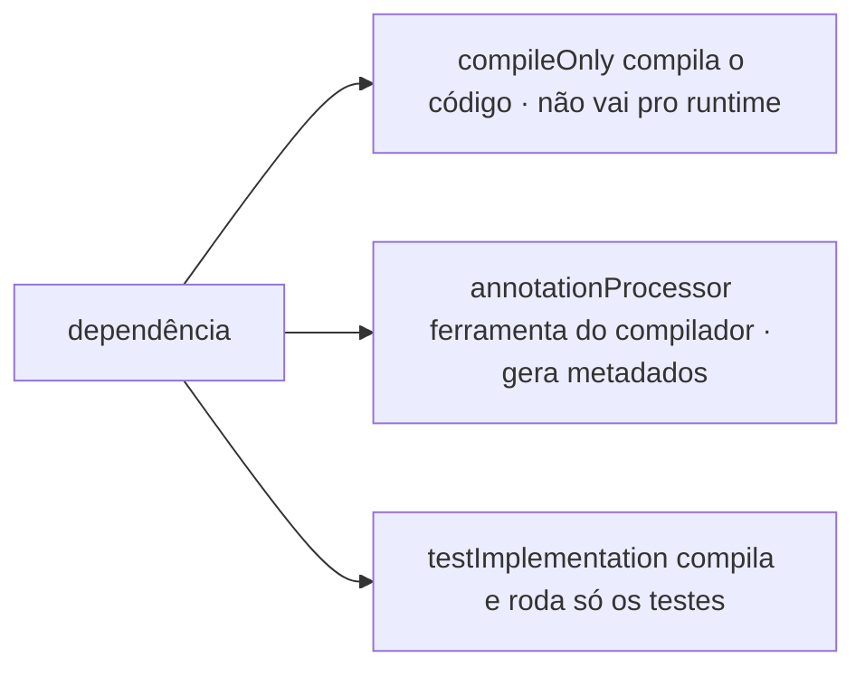

No Gradle, cada tipo de dependência entra em um **classpath diferente**. Isso define em qual momento aquela biblioteca será usada: durante a compilação, durante o processamento de anotações, durante os testes ou em runtime.

O cenário típico onde os três aparecem juntos é o `build.gradle` de uma **biblioteca ou starter Spring Boot**:

```groovy title="build.gradle"
compileOnly platform('org.springframework.boot:spring-boot-dependencies:3.3.0')
compileOnly 'org.springframework.boot:spring-boot-autoconfigure'
compileOnly 'org.springframework:spring-context'
compileOnly 'org.slf4j:slf4j-api'

annotationProcessor platform('org.springframework.boot:spring-boot-dependencies:3.3.0')
annotationProcessor 'org.springframework.boot:spring-boot-autoconfigure-processor'

testImplementation platform('org.springframework.boot:spring-boot-dependencies:3.3.0')
testImplementation 'org.springframework.boot:spring-boot-starter-test'
testImplementation 'ch.qos.logback:logback-classic'
```



## `compileOnly`

Significa: **"preciso dessa dependência para compilar meu código, mas ela não deve ser empacotada nem exposta como dependência de runtime."**

```groovy
compileOnly 'org.springframework:spring-context'
compileOnly 'org.slf4j:slf4j-api'
```

O código principal pode importar e usar as classes normalmente:

```java
import org.springframework.context.ApplicationContext;
import org.slf4j.Logger;
```

Mas essas dependências não serão levadas junto no runtime da biblioteca. É o padrão de quem cria uma **lib, starter ou auto-configuração** para Spring Boot:

- a biblioteca precisa conhecer o Spring para compilar;
- mas quem vai fornecer o Spring em runtime é a aplicação final;
- assim você não empacota dependências desnecessárias nem força versões no consumidor.

Se a sua biblioteca roda dentro de uma aplicação Spring Boot, a aplicação final já terá o `spring-boot-starter` — a lib só precisa compilar contra as APIs.

## `annotationProcessor`

Usado **somente durante a compilação**, para executar processadores de anotação:

```groovy
annotationProcessor 'org.springframework.boot:spring-boot-autoconfigure-processor'
```

Não é uma biblioteca que seu código usa em runtime — é uma **ferramenta que roda durante o build** para analisar anotações e gerar metadados auxiliares. No caso do Spring Boot, o `autoconfigure-processor` gera os metadados de auto-configuração. Outros exemplos clássicos: Lombok e MapStruct.

A diferença para `compileOnly`, em uma linha:

```txt
compileOnly          -> classes que MEU CÓDIGO referencia
annotationProcessor  -> ferramenta DO COMPILADOR/build
```

## `testImplementation`

Significa: **"essa dependência existe somente para compilar e executar os testes."**

```groovy
testImplementation 'org.springframework.boot:spring-boot-starter-test'
testImplementation 'ch.qos.logback:logback-classic'
```

O `spring-boot-starter-test` traz JUnit, Mockito, AssertJ e o suporte de teste do Spring Boot. E há um par que ilustra bem a divisão de classpaths: o código principal depende só da **API** de logging (`compileOnly 'org.slf4j:slf4j-api'`), mas para os testes imprimirem logs de verdade entra uma **implementação** real — `testImplementation 'ch.qos.logback:logback-classic'`.

## E o `implementation`?

Para completar o mapa: `implementation` é a configuração de aplicação comum — a dependência entra no classpath de compilação **e** de runtime, e é empacotada. Numa biblioteca, cada `implementation` vira uma dependência transitiva imposta ao consumidor — por isso libs bem-comportadas preferem `compileOnly` para o que a aplicação final já fornece.

## O papel do `platform(...)`

```groovy
platform('org.springframework.boot:spring-boot-dependencies:3.3.0')
```

Importa o **BOM** (*Bill of Materials*) do Spring Boot — na prática, uma tabela de versões compatíveis e recomendadas. Com ele, você declara dependências **sem informar versão**, e as versões são resolvidas pelo BOM. Isso evita espalhar versões pelo `build.gradle` e reduz o risco de incompatibilidade no ecossistema Spring.

**Por que ele aparece repetido?** Porque cada configuração tem o seu próprio classpath — o BOM precisa ser aplicado separadamente às dependências de compilação, aos processadores de anotação e às de teste.

## Resumo

| Configuração | Quando é usada | Vai para runtime? | Uso comum |
| --- | --- | --- | --- |
| `compileOnly` | Compilação do código principal | Não | APIs fornecidas pela aplicação consumidora |
| `annotationProcessor` | Durante a compilação | Não | Processadores de anotação, geração de metadados |
| `testImplementation` | Compilação e execução dos testes | Apenas nos testes | JUnit, Mockito, Spring Boot Test, Logback de teste |
| `implementation` | Compilação e runtime | Sim | Dependências de verdade da aplicação/lib |

## Conclusão

Para uma biblioteca ou starter Spring Boot, essa separação é saudável: o projeto compila contra Spring e SLF4J sem forçá-los no runtime do consumidor, os processadores de anotação ficam restritos ao build, e as dependências pesadas de teste ficam isoladas no ambiente de teste. É a forma tradicional e segura de manter a biblioteca leve, com baixo acoplamento, sem contaminar quem consome o artefato.

## Fontes

- Gradle — [Dependency Configurations](https://docs.gradle.org/current/userguide/dependency_configurations.html)
- Gradle — [Importing Maven BOMs (platform)](https://docs.gradle.org/current/userguide/platforms.html)
- Spring Boot — [Creating Your Own Auto-configuration](https://docs.spring.io/spring-boot/reference/features/developing-auto-configuration.html)
