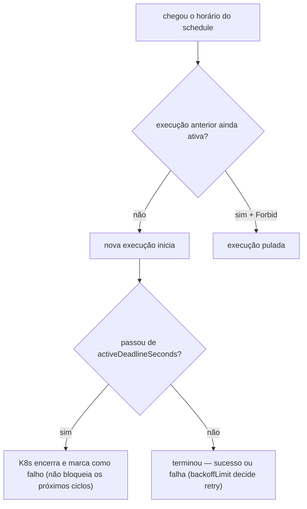

Alguns campos de `CronJob` e `Job` no Kubernetes existem para evitar três problemas clássicos de rotinas agendadas: **execuções duplicadas, retries perigosos e jobs travados**. Entendê-los é essencial para proteger rotinas batch, conciliações, processamentos agendados e qualquer tarefa que não pode rodar em paralelo nem ficar presa indefinidamente.

## O contexto

Esses campos aparecem em configurações como:

```yaml title="cronjob.yaml"
concurrencyPolicy: Forbid
startingDeadlineSeconds: 60
jobTemplate:
  spec:
    activeDeadlineSeconds: 300
    backoffLimit: 0
    template:
      spec:
        restartPolicy: Never
```

Eles controlam três coisas fundamentais:

- Se uma nova execução pode começar enquanto a anterior ainda está rodando.
- Quanto tempo o Kubernetes aceita esperar para iniciar uma execução atrasada.
- O que acontece quando o job falha ou fica rodando tempo demais.

Isso importa principalmente quando o processamento altera dados, envia eventos, faz conciliação, processa pagamentos ou recalcula saldos — tarefas que **não devem duplicar efeito**.



## `concurrencyPolicy: Forbid`

Pertence ao `CronJob`. Define o que fazer quando chega o horário de uma nova execução mas a anterior ainda está ativa:

- `Allow` — permite execuções simultâneas.
- `Forbid` — impede a nova execução se a anterior ainda roda.
- `Replace` — mata a anterior e sobe a nova.

Com `Forbid`, o Kubernetes entende: *"se o job anterior ainda está rodando, não inicia outro."* É o comportamento mais seguro quando a rotina não pode executar duas vezes ao mesmo tempo.

**Exemplo prático:** um job de conciliação roda a cada 10 minutos. Se uma execução demorar 15 minutos com `Allow`, duas conciliações rodam juntas — duplicidade, disputa de dados, processamento fora de ordem. Com `Forbid`, a nova execução é pulada enquanto a antiga estiver ativa.

## `backoffLimit`

Pertence ao `Job`. Define quantas vezes o Kubernetes pode tentar novamente quando o job falha. `backoffLimit: 3` = até 3 recriações do Pod antes de considerar o Job falho.

Com `backoffLimit: 0`, o comportamento fica rígido: *"falhou uma vez, acabou."* Útil quando retry automático pode causar problema:

- Reprocessar o mesmo arquivo.
- Enviar a mesma mensagem duas vezes.
- Recalcular uma operação sensível.
- Tentar de novo **sem saber se a anterior falhou antes ou depois de gravar dados**.

Em jobs sensíveis, muitas vezes é melhor falhar claramente, gerar log/alerta, e deixar uma pessoa (ou um processo controlado) decidir o reprocessamento.

## `activeDeadlineSeconds`

Pertence ao `Job`. Define o tempo máximo que uma execução pode ficar ativa — `300` = no máximo 5 minutos; passou, o Kubernetes encerra e marca o Job como falho.

É a **proteção obrigatória** quando se usa `concurrencyPolicy: Forbid`: se um job travar e nunca terminar, o `Forbid` impediria todos os ciclos seguintes de iniciar. Sem `activeDeadlineSeconds`, um job travado **bloqueia a agenda inteira**.

```yaml
schedule: "*/10 * * * *"
concurrencyPolicy: Forbid
activeDeadlineSeconds: 300
```

Leitura prática: *"rode a cada 10 minutos, cada execução dura no máximo 5. Se travar, o Kubernetes mata — e uma execução presa não bloqueia as próximas."*

## `startingDeadlineSeconds`

Pertence ao `CronJob`. Define por quanto tempo o Kubernetes ainda aceita iniciar uma execução que **perdeu o horário** agendado. Com `60`: *"se estava agendado para 10:00, só pode iniciar até 10:01; depois, considera a execução perdida."*

**Exemplo prático:** um job deveria rodar às 02:00, numa janela controlada de processamento. Se o cluster ficou instável e o controller só percebeu às 02:30, talvez não faça mais sentido rodar. O `startingDeadlineSeconds` protege a rotina contra execução fora da janela.

## `restartPolicy: Never`

Pertence ao template do Pod. Em Jobs, os valores usados são `Never` e `OnFailure`. Com `Never`, o container que falha **não é reiniciado dentro do mesmo Pod** — quem decide se haverá nova tentativa é o próprio Job, respeitando o `backoffLimit`.

A combinação `restartPolicy: Never` + `backoffLimit: 0` dá o comportamento mais previsível: *"o container falhou, o Pod falhou, o Job falhou. Não tenta de novo."* Sem retry automático escondido.

## Como trabalham juntos

```yaml title="cronjob.yaml — exemplo completo"
apiVersion: batch/v1
kind: CronJob
metadata:
  name: exemplo-processamento
spec:
  schedule: "*/10 * * * *"
  concurrencyPolicy: Forbid
  startingDeadlineSeconds: 60
  jobTemplate:
    spec:
      activeDeadlineSeconds: 300
      backoffLimit: 0
      template:
        spec:
          restartPolicy: Never
          containers:
            - name: processamento
              image: minha-imagem:latest
```

Em português claro:

- Rode a cada 10 minutos.
- Não deixe duas execuções rodarem ao mesmo tempo.
- Se atrasar mais de 60 segundos, pule aquela execução.
- Cada execução dura no máximo 5 minutos.
- Se falhar, não tente novamente.
- Se o container cair, não reinicie dentro do mesmo Pod.

## Resumo

| Campo | Onde fica | Para que serve |
| --- | --- | --- |
| `concurrencyPolicy` | `CronJob` | Controla se pode haver mais de um Job simultâneo |
| `startingDeadlineSeconds` | `CronJob` | Até quando uma execução atrasada ainda pode começar |
| `activeDeadlineSeconds` | `Job` | Tempo máximo de vida de uma execução |
| `backoffLimit` | `Job` | Quantas tentativas após falha |
| `restartPolicy` | Pod template | Se o container reinicia dentro do mesmo Pod |

## O ponto mais importante

O campo mais crítico do conjunto é o `activeDeadlineSeconds`. Sem ele, um job pode ficar travado indefinidamente — e com `concurrencyPolicy: Forbid`, esse job travado impede todos os ciclos seguintes. A regra prática:

> **Se usar `concurrencyPolicy: Forbid`, defina também `activeDeadlineSeconds`.**

## Fontes

- Kubernetes — [CronJob](https://kubernetes.io/docs/concepts/workloads/controllers/cron-jobs/)
- Kubernetes — [Job](https://kubernetes.io/docs/concepts/workloads/controllers/job/)
