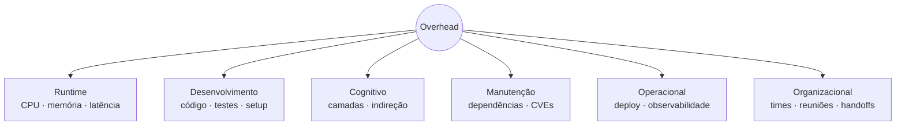

Em desenvolvimento de software, **overhead** é o **custo operacional ou esforço extra** necessário para executar uma tarefa, enquanto **overkill** (ou *overengineering*) é o ato de **aplicar uma solução complexa ou desproporcional** para resolver um problema simples. Em suma: o overhead é o "imposto" pago por uma escolha, e o overkill é o "exagero" da escolha.

Os dois conceitos são relacionados, mas operam em planos distintos: overhead é uma **propriedade descritiva** (toda escolha tem algum), enquanto overkill é um **juízo de valor** (a relação entre a complexidade da solução e o tamanho real do problema). O erro mais comum ao avaliar overhead é considerar só runtime (CPU, memória, latência); na prática ele se manifesta em várias dimensões — e as invisíveis costumam pesar mais a longo prazo que qualquer ganho de performance prometido. Bom design não elimina overhead: **aceita o overhead certo pelos motivos certos**. Overkill é quando essa proporção quebra.

## 1. Overhead — o "imposto" inevitável de toda escolha

É o custo extra que uma decisão técnica cobra além do trabalho essencial. Toda escolha tem overhead — o ponto não é eliminá-lo, é decidir conscientemente onde gastá-lo.

## 2. As seis dimensões do overhead

Considerar só runtime é o erro clássico. Hardware é barato; o que sai caro é tudo o que não aparece em dashboard de APM.

**a) Runtime** (o mais óbvio)

- CPU, memória, latência, I/O, rede, armazenamento.
- Fácil de medir e justificar tecnicamente.

**b) Desenvolvimento**

- Mais código para escrever, mais testes para cobrir, mais configuração para manter.
- Curva de aprendizado da stack escolhida.
- Setup do ambiente local — um dev novo roda o projeto em 2 dias ou 2 semanas?
- Tempo gasto em decisões de design que poderiam ser triviais.

**c) Cognitivo** (frequentemente o pior)

- Quantos conceitos alguém precisa segurar na cabeça para entender um fluxo simples?
- Indireção excessiva — para entender o que um endpoint faz, é preciso navegar por 7 camadas, 3 interfaces e 2 design patterns.
- Abstrações prematuras que escondem mais do que revelam.
- É o tipo de custo que faz um sênior levar uma tarde para uma mudança que deveria ser de 15 minutos.

**d) Manutenção**

- Mais dependências = mais CVEs, mais upgrades, mais incompatibilidades.
- Mais serviços = mais pipelines, mais dashboards, mais alertas, mais on-call.
- Documentação que precisa ser mantida sincronizada.
- Refatoração: mudar algo simples exige tocar em N lugares.

**e) Operacional**

- Observabilidade: tracing distribuído, correlação de logs entre serviços.
- Debugar problemas que cruzam fronteiras de rede/processo.
- Deploy coordenado, versionamento de contratos, compatibilidade entre serviços.
- Custos de infra: cluster, brokers, bancos extras, ferramentas de APM.

**f) Organizacional**

- Mais times necessários, mais reuniões de alinhamento, mais handoffs.
- Onboarding mais lento.
- Conhecimento concentrado em poucas cabeças ("só o fulano sabe mexer nisso").

## 3. Overhead bem ou mal investido

- **HTTPS** — overhead de handshake TLS e criptografia. Justificado quase sempre.
- **Garbage collector** — overhead de pausas e CPU. Preço de não gerenciar memória manualmente.
- **Microsserviços** — overhead de rede, serialização, observabilidade e coordenação entre times.
- **ORM** — overhead de abstração e queries muitas vezes subótimas; em sistemas de médio porte, a produtividade compensa.
- **Reuniões diárias** — overhead de tempo do time. Parte do processo.

## 4. Overkill — a escolha desproporcional

Julgamento de que a solução escolhida é grande demais para o problema. O foco não é o custo em si, mas a relação entre a complexidade da solução e o tamanho real do problema.

Exemplos clássicos:

- Subir Kubernetes para servir um blog estático com 50 visitas por dia.
- Quebrar uma API CRUD com 3 endpoints em 8 microsserviços.
- Implementar CQRS + Event Sourcing num cadastro simples de clientes.
- Usar Kafka para passar mensagens entre dois serviços que trocam 10 eventos por hora — uma fila SQS ou até um cron resolveria.
- Criar abstração genérica "para trocar de banco no futuro" quando o sistema nunca trocará.

## 5. Como os dois se relacionam

**Toda solução overkill carrega overhead desnecessário, mas nem todo overhead é overkill.**

| Cenário | Tem overhead? | É overkill? |
| --- | --- | --- |
| HTTPS num e-commerce | Sim (TLS) | Não — necessário |
| Kubernetes num blog pessoal | Sim (alto) | Sim |
| ORM num sistema de médio porte | Sim (abstração) | Não — produtividade compensa |
| Event Sourcing num form de contato | Sim (enorme) | Sim |

## 6. Por que considerar todas as dimensões muda a conversa

Considerando só CPU e memória, muita coisa parece "barata o suficiente" — hardware é barato. Mas quando se soma:

- 6 meses a mais de desenvolvimento;
- 3 devs precisando entender Kafka + Saga + Event Sourcing para trocar o label de um botão;
- um incidente em produção que leva 4 horas para debugar porque o trace passa por 8 serviços;
- um dev novo demorando 1 mês para o primeiro PR útil;

…o overhead "invisível" supera com folga qualquer ganho de performance ou escalabilidade prometido.

Por isso a frase clássica do John Ousterhout em *A Philosophy of Software Design*: **complexidade é tudo que dificulta entender ou modificar um sistema**. E é cumulativa — cada decisão adiciona um pouquinho, até o sistema ficar "pesado" para evoluir mesmo rodando rápido na máquina.

## 7. A analogia que fixa

Dirigir qualquer carro tem overhead (combustível, manutenção, estacionamento). Pegar uma Ferrari para comprar pão na esquina é overkill — tem todo o overhead de um carro caro **e** a escolha em si é desproporcional ao problema.

## 8. Critério prático

Na avaliação de overkill, a pergunta útil não é "isso tem overhead?" (sempre tem), mas:

> **"O custo total de propriedade dessa escolha pelos próximos 2–3 anos — considerando runtime, desenvolvimento, cognição, manutenção, operação e organização — é proporcional ao problema que estou resolvendo?"**

Quando a resposta é não, é overengineering. E lembre sempre: **adicionar complexidade depois é fácil; tirar é muito difícil** (YAGNI — *You Aren't Gonna Need It*).

## Fontes

- John Ousterhout — [A Philosophy of Software Design](https://web.stanford.edu/~ouster/cgi-bin/aPoSD.php)
- Martin Fowler — [Yagni](https://martinfowler.com/bliki/Yagni.html)
- Martin Fowler — [Technical Debt](https://martinfowler.com/bliki/TechnicalDebt.html)
- Sandi Metz — [The Wrong Abstraction](https://sandimetz.com/blog/2016/1/20/the-wrong-abstraction)
- Wikipedia — [Overengineering](https://en.wikipedia.org/wiki/Overengineering)
