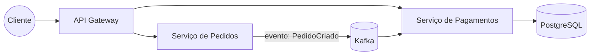
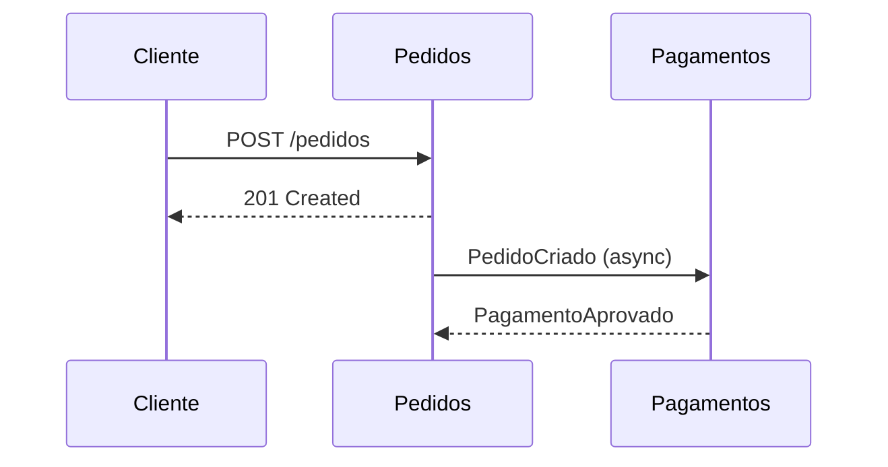

# Recursos deste blog

Este post é um tour (e uma referência viva) dos recursos disponíveis para escrever posts aqui. Tudo funciona direto no Markdown.

## Blocos de código com Expressive Code

Os blocos de código usam o [Expressive Code](https://expressive-code.com), com moldura de editor, botão de copiar e vários extras.

### Título de arquivo e destaque de linhas

```java title="PedidoService.java" {6-8}
@Service
public class PedidoService {

  private final PedidoRepository repository;

  public Pedido criar(NovoPedido novoPedido) {
    return repository.save(Pedido.de(novoPedido));
  }
}
```

As linhas 6–8 aparecem destacadas — útil para chamar atenção ao trecho que importa.

### Estilo terminal

```bash title="Terminal"
npm create astro@latest
cd meu-site && npm run dev
```

### Diff (o que mudou)

```java del={3} ins={4}
public BigDecimal calcularTotal(List<Item> itens) {
  return itens.stream()
    .map(Item::getPreco)
    .map(item -> item.getPreco().multiply(BigDecimal.valueOf(item.getQuantidade())))
    .reduce(BigDecimal.ZERO, BigDecimal::add);
}
```

### Números de linha e seções recolhidas

```ts showLineNumbers collapse={1-4}
// imports e setup ficam recolhidos
import { defineConfig } from "astro/config";
import mdx from "@astrojs/mdx";
import svelte from "@astrojs/svelte";

export default defineConfig({
  integrations: [mdx(), svelte()],
});
```

## Diagramas com Mermaid

Como este site fala de arquitetura, diagramas são essenciais. Basta um bloco de código com a linguagem `mermaid`:



Sequência também funciona:



## Fórmulas matemáticas

KaTeX renderiza LaTeX no meio do texto ($O(n \log n)$) ou em bloco:

$$
\text{Disponibilidade} = \frac{MTBF}{MTBF + MTTR}
$$

## E o básico, claro

Tabelas:

| Recurso | Sintaxe | Quando usar |
| --- | --- | --- |
| Código | ` ```lang ` | Sempre que houver código |
| Diagrama | ` ```mermaid ` | Arquitetura, fluxos, sequências |
| Fórmula | `$...$` ou `$$...$$` | Métricas, complexidade |

Citações:

> Arquitetura é sobre as decisões difíceis de mudar depois.

Listas de tarefas:

- [x] Site no ar
- [ ] Escrever o primeiro post de arquitetura
- [ ] Substituir os projetos placeholder

## Componentes interativos (MDX)

Posts também podem ser arquivos `.mdx`, o que permite embutir **componentes Svelte interativos** — útil para demos animadas e diagramas interativos em posts futuros. Quando o assunto pedir, é só criar.
