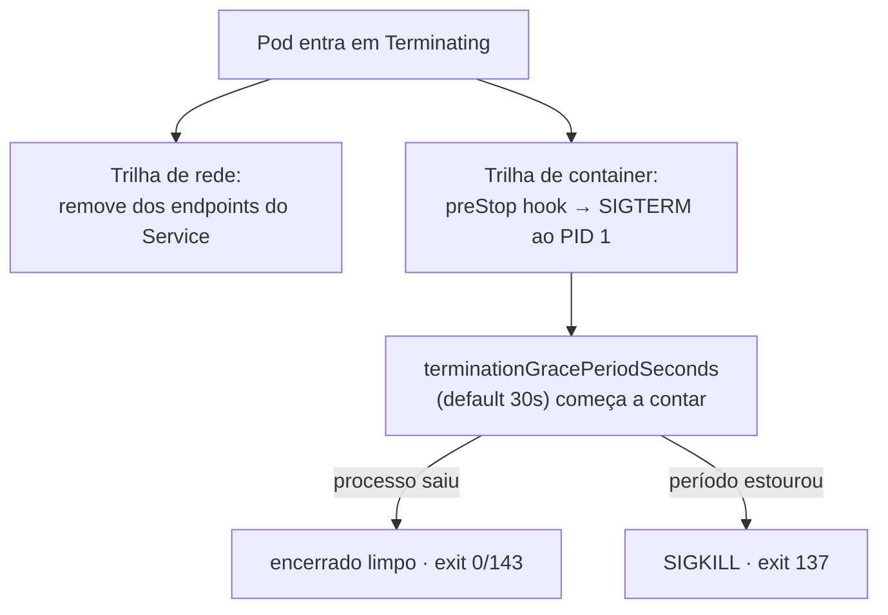

`SIGTERM` (sinal 15) e `SIGKILL` (sinal 9) são sinais Unix usados pelo Kubernetes para encerrar containers. O `SIGTERM` é um pedido educado de término — o processo recebe, pode executar limpeza e então sair. O `SIGKILL` é um abate forçado: não pode ser capturado nem ignorado, o kernel mata o processo imediatamente. Entender essa diferença é central para fazer deploys, scale-ins e evictions **sem perder requisições nem corromper estado**.

## Os dois sinais

- **`SIGTERM` (15)** — sinal capturável. O processo pode registrar um handler e executar shutdown gracioso: parar de aceitar novas conexões, terminar requisições em andamento, fechar conexões com banco, liberar locks distribuídos, fazer flush de buffers e métricas.
- **`SIGKILL` (9)** — sinal não capturável. O kernel mata o processo na hora; nenhuma rotina de cleanup roda. Risco de perda de dados, conexões zumbis no banco, transações pela metade.

## O ciclo de término de um pod

Quando um pod entra em `Terminating` (delete manual, rolling update, scale-in, eviction, `activeDeadlineSeconds` atingido), o kubelet executa **duas trilhas em paralelo**:



1. **Trilha de rede** — o pod é removido dos endpoints do Service; kube-proxy e ingress controllers param de rotear tráfego novo.
2. **Trilha de container** — o kubelet executa o `preStop` hook (se configurado) e depois envia `SIGTERM` ao PID 1 de cada container.
3. Começa a contagem do `terminationGracePeriodSeconds` (default 30s). Importante: esse período cobre o `preStop` **e** o shutdown do app — é um orçamento compartilhado, não acumulativo.
4. Se o container ainda estiver vivo ao fim do período, o kubelet envia `SIGKILL`.

## A race condition de endpoint

As duas trilhas são paralelas. Existe uma janela de alguns segundos em que o pod já recebeu `SIGTERM` mas o load balancer/ingress **ainda roteia tráfego para ele** (o cache de endpoints é eventualmente consistente). Por isso é prática comum usar um `preStop` com `sleep` de 5–15s antes do `SIGTERM`:

```yaml title="deployment.yaml"
spec:
  terminationGracePeriodSeconds: 60
  containers:
    - name: app
      image: my-app:1.0.0
      lifecycle:
        preStop:
          exec:
            command: ["/bin/sh", "-c", "sleep 15"]
```

O `sleep` em si não drena conexões — ele apenas **atrasa o `SIGTERM`**, dando margem para o tráfego parar de chegar antes de o app começar a se desmontar.

## Exit codes úteis para diagnóstico

- `0` — shutdown limpo (o handler do `SIGTERM` rodou e o processo saiu normalmente).
- `143` — saiu por `SIGTERM` sem handler (128 + 15).
- `137` — morto por `SIGKILL` (128 + 9). Indica grace period estourado, OOMKilled, ou `--force --grace-period=0`.

## Spring Boot — graceful shutdown nativo (desde 2.3)

Suporte built-in, válido para os quatro web servers embarcados (Tomcat, Jetty, Reactor Netty, Undertow):

```yaml title="application.yml"
server:
  shutdown: graceful
spring:
  lifecycle:
    timeout-per-shutdown-phase: 25s
```

Ao receber `SIGTERM`, o Spring Boot:

- Faz o web server parar de aceitar **novas** requisições na camada de rede (Tomcat, Netty, Jetty) ou responder `503` para novas (Undertow).
- Espera as requisições em andamento terminarem, até o limite de `timeout-per-shutdown-phase`.
- Fecha o `ApplicationContext` — pools, conexões, schedulers, métodos `@PreDestroy`.

## Sintonia entre Spring e Kubernetes

A janela do Spring precisa caber dentro do grace period do Kubernetes, que também cobre o `preStop`. Fórmula prática:

```txt
preStop sleep + Spring timeout + folga ≤ terminationGracePeriodSeconds
       15s    +       25s      +   5s  ≤        60s
```

Se o Spring demorar mais que o `terminationGracePeriodSeconds`, o K8s manda `SIGKILL` **no meio do shutdown** — exatamente o oposto do que se queria.

## Cleanup adicional via @PreDestroy

Para liberar recursos próprios (ExecutorService, locks, conexões custom), um bean com `@PreDestroy` basta — o Spring o chama durante o fechamento do contexto, dentro da janela do graceful shutdown:

```java title="JobWorker.java"
@Component
public class JobWorker {
    private final ExecutorService executor = Executors.newFixedThreadPool(8);

    @PreDestroy
    public void shutdown() {
        executor.shutdown();
        try {
            if (!executor.awaitTermination(20, TimeUnit.SECONDS)) {
                executor.shutdownNow();
            }
        } catch (InterruptedException e) {
            executor.shutdownNow();
            Thread.currentThread().interrupt();
        }
    }
}
```

Para jobs longos (não-web), o padrão clássico é o shutdown hook + `AtomicBoolean stopping` — registrado em `Runtime.getRuntime().addShutdownHook(...)`, ele sinaliza o loop de trabalho para encerrar no próximo check (detalhado no post [AtomicBoolean — parada graciosa thread-safe](/posts/atomicboolean-parada-graciosa/)).

## A pegadinha do PID 1

Para o Spring receber o `SIGTERM`, o processo `java` precisa ser o **PID 1** do container. O bug clássico:

```dockerfile title="Dockerfile"
# ❌ ERRADO — shell vira PID 1 e não propaga sinais
ENTRYPOINT ["sh", "-c", "java -jar app.jar"]

# ✅ CORRETO — exec form, java é PID 1
ENTRYPOINT ["java", "-jar", "/app.jar"]
```

No primeiro caso, o `sh` é PID 1, recebe o `SIGTERM` mas **não repassa** para o filho `java`. Resultado: nenhum handler dispara, o graceful shutdown nunca acontece, e o app só morre no `SIGKILL` após o grace period. Quando o shell é mesmo necessário (substituição de variáveis, scripts de entrypoint), use `exec` dentro do script (`exec java -jar app.jar`) ou um init mínimo como `tini` / `dumb-init`.

## Quando o SIGTERM é pulado

- **`kubectl delete --grace-period=0 --force`** — manda `SIGKILL` direto. Só em emergência (pod travado).
- **OOMKilled** — o kernel mata por out-of-memory; não há grace period possível.
- **Node pressure forte** — evictions podem encurtar o grace period.

Por isso, mesmo com SIGTERM handling perfeito, o app precisa tolerar morte súbita: operações idempotentes, locks com TTL, transações curtas, batches commitáveis em pedaços.

## Fontes

- Kubernetes — [Pod Lifecycle: Termination](https://kubernetes.io/docs/concepts/workloads/pods/pod-lifecycle/#pod-termination)
- Spring Boot — [Graceful Shutdown](https://docs.spring.io/spring-boot/reference/web/graceful-shutdown.html)
- Google Cloud — [Kubernetes best practices: terminating with grace](https://cloud.google.com/blog/products/containers-kubernetes/kubernetes-best-practices-terminating-with-grace)
- CNCF — [Decoding the pod termination lifecycle](https://www.cncf.io/blog/2024/12/19/decoding-the-pod-termination-lifecycle-in-kubernetes-a-comprehensive-guide/)
- Baeldung — [Web Server Graceful Shutdown in Spring Boot](https://www.baeldung.com/spring-boot-web-server-shutdown)
