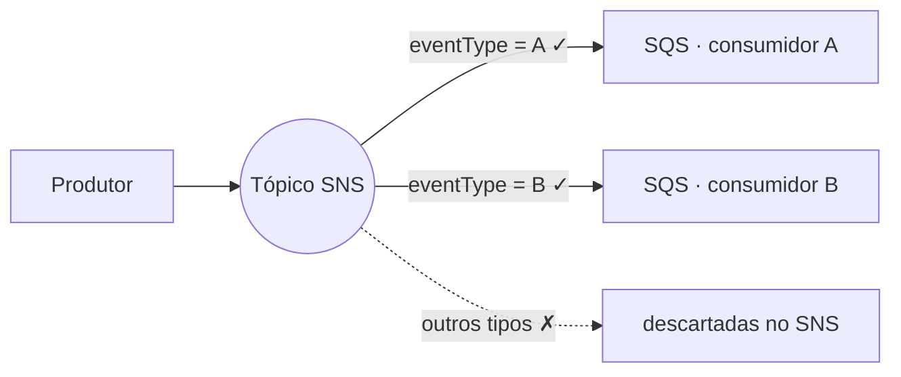

**MessageAttributes** são metadados enviados junto com uma mensagem SNS, **fora do body**. Eles são indexados pelo próprio SNS — não pelo consumidor. Isso permite configurar **Filter Policies** nas assinaturas SQS: o SNS só entrega a mensagem à fila se os atributos corresponderem ao filtro. Mensagens que não passam **nunca chegam ao SQS** — o filtro roda na infraestrutura do SNS (server-side), sem custo de processamento para o consumidor.

## Como funciona na prática

Ao publicar, o produtor adiciona atributos à mensagem:

```java title="Produtor"
MessageBuilder.withPayload(event)
    .setHeader("eventType", "OrderCreatedEvent")  // vira MessageAttribute no SNS
    .build()
```

Na assinatura SQS, você configura o Filter Policy (JSON):

```json title="Filter Policy da assinatura"
{ "eventType": ["OrderCreatedEvent"] }
```

Resultado: somente mensagens com `eventType = OrderCreatedEvent` chegam a essa fila. Outros tipos publicados no mesmo tópico SNS são descartados antes de chegar ao SQS.



## Por que isso importa

- **Sem Filter Policy:** todas as mensagens do tópico chegam à fila — o consumidor recebe e descarta o que não é dele.
- **Com Filter Policy:** só o que interessa chega — menos mensagens recebidas, menos processamento desperdiçado, menor custo (SQS cobra por mensagem recebida).
- O filtro é configurado na **assinatura**, não no produtor — o produtor não precisa saber quem vai consumir. É o desacoplamento clássico do pub/sub, só que com entrega seletiva.
- Limites: até 10 MessageAttributes por mensagem; tipos suportados: String, Number e Binary.

Vale saber que, além dos atributos, o SNS também suporta filtrar **pelo corpo da mensagem** (`FilterPolicyScope: MessageBody`) — útil quando você não controla o produtor. Mas filtrar por atributo continua sendo o caminho padrão: é mais barato de avaliar e não acopla o filtro ao formato do payload.

## Fontes

- AWS — [SNS Subscription Filter Policies](https://docs.aws.amazon.com/sns/latest/dg/sns-subscription-filter-policies.html)
- AWS — [SNS Message Attributes](https://docs.aws.amazon.com/sns/latest/dg/sns-message-attributes.html)
