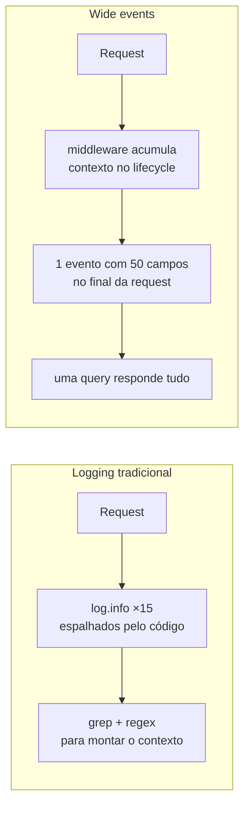

**Wide Events** (ou *Canonical Log Lines*, termo cunhado pela Stripe) é um padrão de logging em que cada requisição emite **um único evento estruturado e rico em contexto** ao final do processamento, em vez de espalhar dezenas de `log.info` pelo código. Esse único evento (frequentemente com 30–50+ campos) contém tudo que pode ser útil para debug: ID da requisição, dados do usuário (tier, idade da conta, LTV), métricas (latência, queries, cache hit/miss), feature flags ativas, contexto de negócio e erro detalhado quando aplicável.

É o que Charity Majors (Honeycomb) chama de **Observability 2.0**: uma única fonte de verdade — eventos arbitrariamente largos e estruturados — da qual métricas, traces e dashboards podem ser derivados, em contraste com a abordagem clássica dos "três pilares" (metrics + logs + traces) com fontes de verdade separadas.

## 1. O problema que o padrão resolve

Logging tradicional foi desenhado para uma era de monólitos e single-server. Hoje, uma única requisição passa por 15 serviços, 3 bancos, 2 caches e uma fila. Os logs continuam atuando como se fosse 2005 — dezenas de linhas espalhadas, cada uma com um pedaço do contexto. Quando um usuário reclama, você gasta horas grepando texto, montando o quebra-cabeça com regex frágil.

**Structured logging (JSON) é necessário mas não suficiente** — ter logs em JSON sem disciplina arquitetural ainda gera 15 eventos parciais por request em vez de 1 evento completo.



## 2. Vocabulário fundamental

- **Cardinality (cardinalidade)** — quantidade de valores únicos que um campo pode ter. `user_id` (milhões) é alta cardinalidade; `http_method` (GET, POST, PUT, DELETE) é baixa. **Alta cardinalidade é o que torna logs realmente úteis para debug** — permite agrupar e filtrar por entidades reais.
- **Dimensionality (dimensionalidade)** — quantos campos cada evento carrega. 5 campos = baixa; 50 campos = alta. Mais dimensões = mais perguntas que você consegue responder sem reinstrumentar.
- **Wide Event** — um evento de log denso, com 30–50+ campos, emitido uma vez por requisição por serviço, contendo todo o contexto relevante.
- **Canonical Log Line** — sinônimo de wide event, termo cunhado pela Stripe no blog de Brandur Leach em 2016.
- **Observability 2.0** — termo da Charity Majors (CTO da Honeycomb) para a arquitetura em que **uma única fonte de verdade** (wide events estruturados, em column store como ClickHouse) substitui os "três pilares" separados. Métricas e SLOs são derivados em tempo de query.

## 3. Anatomia de um wide event

Um único evento JSON cobrindo uma falha de checkout:

```json title="wide event — falha de checkout"
{
  "timestamp": "2026-05-19T10:23:45.612Z",
  "request_id": "req_8bf7ec2d",
  "trace_id": "abc123",
  "service": "checkout-service",
  "version": "2.4.1",
  "region": "us-east-1",
  "method": "POST",
  "path": "/api/checkout",
  "status_code": 500,
  "duration_ms": 1247,
  "user": {
    "id": "user_456",
    "subscription": "premium",
    "account_age_days": 847,
    "lifetime_value_cents": 284700
  },
  "cart": {
    "id": "cart_xyz",
    "item_count": 3,
    "total_cents": 15999,
    "coupon_applied": "SAVE20"
  },
  "payment": {
    "method": "card",
    "provider": "stripe",
    "latency_ms": 1089,
    "attempt": 3
  },
  "error": {
    "type": "PaymentError",
    "code": "card_declined",
    "stripe_decline_code": "insufficient_funds",
    "retriable": false
  },
  "feature_flags": {
    "new_checkout_flow": true,
    "express_payment": false
  }
}
```

Com isso, uma única query (`user_id = "user_456"`) já diz: cliente premium, 2+ anos de conta, falha no 3º attempt, motivo real (`insufficient_funds`), no novo fluxo de checkout. Sem grep, sem buscas em N serviços.

## 4. Implementação prática — middleware/filter

A chave é **construir o evento ao longo do lifecycle da request** num middleware e emitir **uma vez só no final**. Em Spring Boot, dá para implementar com um `OncePerRequestFilter` que cria o objeto de evento, deixa os services enriquecerem com contexto de negócio, e emite o JSON estruturado no `finally`:

```java title="CanonicalLogFilter.java"
@Component
public class CanonicalLogFilter extends OncePerRequestFilter {
    private static final Logger log = LoggerFactory.getLogger("canonical");

    @Override
    protected void doFilterInternal(HttpServletRequest req, HttpServletResponse res, FilterChain chain)
            throws ServletException, IOException {
        var event = new HashMap<String, Object>();
        event.put("request_id", UUID.randomUUID().toString());
        event.put("method", req.getMethod());
        event.put("path", req.getRequestURI());
        long start = System.currentTimeMillis();
        req.setAttribute("canonical_event", event);
        try {
            chain.doFilter(req, res);
        } finally {
            event.put("status_code", res.getStatus());
            event.put("duration_ms", System.currentTimeMillis() - start);
            // emite via Logback + structured logging (ECS/Logstash)
            log.info("request.completed", StructuredArguments.entries(event));
        }
    }
}
```

No original da Stripe (Ruby), a emissão é envolvida em `ensure`/`begin-rescue` para garantir que a canonical line saia mesmo se houver exceção — e que falhas na construção do evento nunca derrubem a request.

## 5. Tail sampling — controle de custo

50 campos × 10k req/s pode estourar o orçamento de observabilidade. Random sampling burro é perigoso (pode jogar fora justo a requisição que explica o outage). **Tail sampling** decide *depois* da request terminar, com base no resultado:

- 100% dos erros (status ≥ 500, exceções).
- 100% das slow requests (acima do p99).
- 100% de usuários VIP / contas internas / sessões flagadas.
- Random sample (1–5%) do resto.

## 6. Por que OpenTelemetry sozinho não resolve

OTel é **protocolo de entrega** e SDK de instrumentação, não estratégia. Ele padroniza *como* a telemetria viaja, mas não decide *o que* incluir no evento nem adiciona contexto de negócio. Você ainda precisa instrumentar com `subscription_tier`, `cart_value`, `feature_flags` etc. Idealmente, **seus wide events são os próprios spans do trace**, enriquecidos com todo o contexto necessário — não duplicados em formatos separados.

## 7. Conexão com o structured logging do Spring Boot

O `LogstashEncoder` e o structured logging nativo do Spring Boot 3.4 entregam a **infraestrutura** (JSON, MDC, campos indexados). Wide events são a **disciplina arquitetural** em cima dessa base: em vez de espalhar `log.info` pelo código de negócio, você concentra a emissão num filter que acumula contexto durante o processamento e emite um único evento gordo no final. O JSON sai pelo mesmo pipeline (ECS, Logstash, GELF) — muda só *o que* e *quando* você emite, não *como*.

## Fontes

- Boris Tane — [Logging Sucks](https://loggingsucks.com/)
- Brandur Leach — [Using Canonical Log Lines for Online Visibility](https://brandur.org/canonical-log-lines) (2016, artigo que cunhou o termo)
- Stripe Engineering — [Fast and Flexible Observability with Canonical Log Lines](https://stripe.com/blog/canonical-log-lines) (2019)
- Charity Majors / Honeycomb — [It's Time to Version Observability](https://www.honeycomb.io/blog/time-to-version-observability-signs-point-to-yes)
- Honeycomb — [One Key Difference Between Observability 1.0 and 2.0](https://www.honeycomb.io/blog/one-key-difference-observability1dot0-2dot0)
